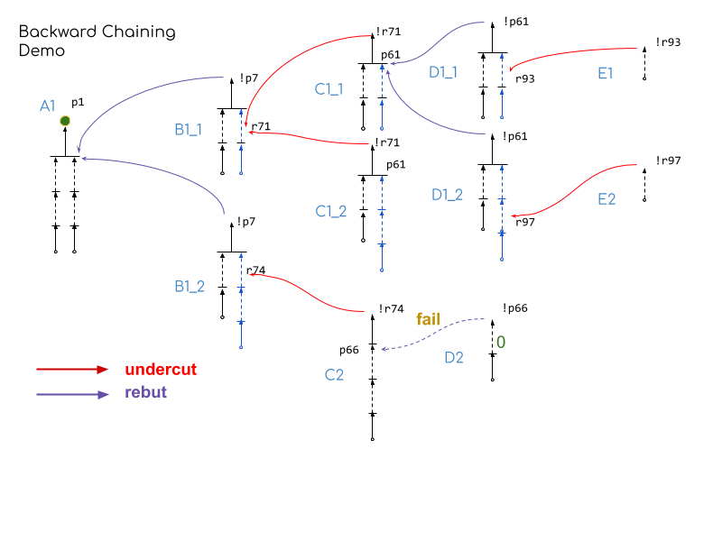
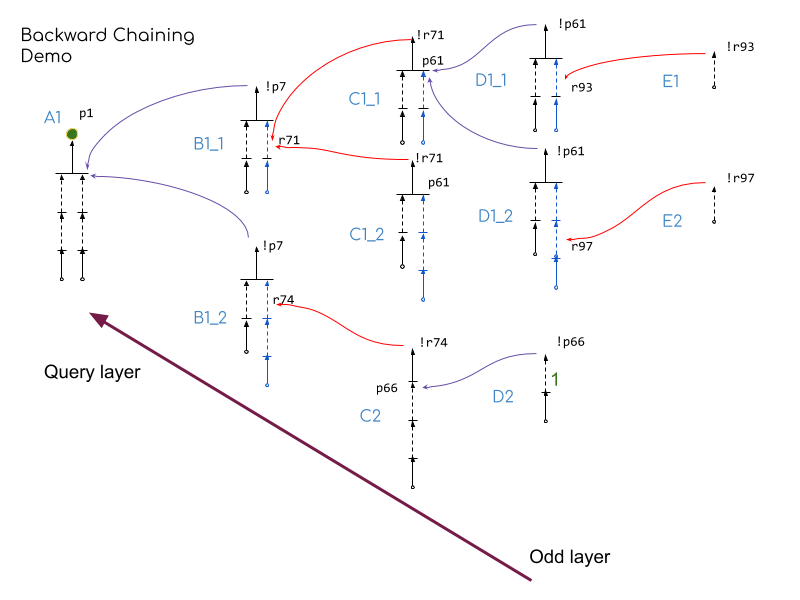
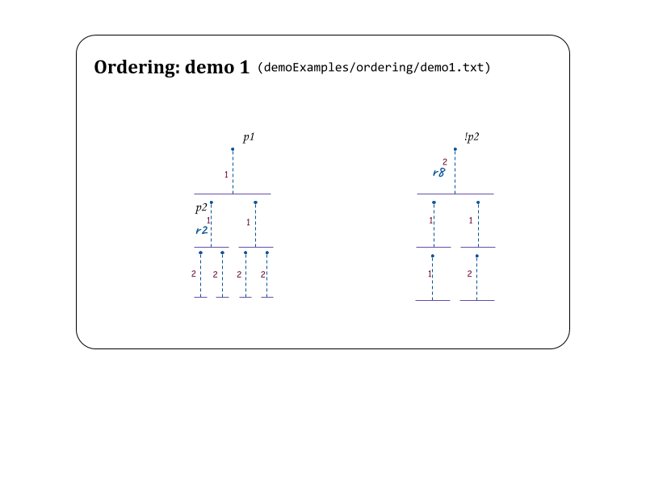

# DT examples
#### Build Project and Test
1. You could build the project to get the executable file.
    > `stack build --copy-bins`
1. Demo search file is "./demoExamples/search/demo.txt" \
   If you would like to query conclusion `p1`, run
    > `DT-exe ./demoExamples/search/demo.txt p1`

    The query result includes 9 paths, each path represents a argument that related to the query conclusion (direct/indirect support/defend).

    > ```
    > [[r6: p6 p7->p1],[r7: p8=>p6,r8: p9=>p7],[r9: p10=>p8,r10: p11=>p9],[r11: ->p10,r12: ->p11]]
    > [[r69: p54 p55->!p7],[r70: p56=>p54,r71: p57=>p55],[r72: ->p56,r73: ->p57]]
    > [[r79: p60 p61->!r71],[r80: p62=>p60,r81: p63=>p61],[r82: ->p62,r83: ->p63]]
    > [[r91: p69 p70->!p61],[r92: p71=>p69,r93: p72=>p70],[r94: ->p71,r95: ->p72]]
    > [[r99: =>!r93]]
    > [[r91: p69 p70->!p61],[r92: p71=>p69,r96: p73=>p70],[r94: ->p71,r97: p74=>p73],[r98: ->p74]]
    > [[r100: =>!r97]]
    > [[r69: p54 p55->!p7],[r70: p56=>p54,r74: p58=>p55],[r72: ->p56,r76: p59=>p58],[r78: ->p59]]
    > [[r87: p66->!r74],[r88: p67=>p66],[r89: p68=>p67],[r90: ->p68]]
    > ```

    

    **Note:**
    1. B1_1, B1_2 are equifinal paths, they all conclude `!p7`. 
        - So the same with C1_1, C1_2 and D1_1 , D1_2. 
        - Divergence of equifinal paths are blue. 
    1. Equifinal paths are ordered by the maximum depth from it's conclusion to facts.
    1. One of even-layer Equifinal Paths is successfully defended is enough. This is why `C1_2` is not in the query result. 
    1. Equifinal Path of odd layer must all be defeaded and included in the query result. 
    1. Equifinal Path of odder layer that attack but cannot defeat previous layer argument successfully will not be included in the query result, this is why `D2` is not in the query result.
    1. This default search relies on (weakest-link + dem) ordering. 
    1. D2 can not defeat C2 successfully, so that all attacker of A1 can be defeated, thus A1 can be defended indirectly. 

    Changing the preference value of the defeasible rule in D2 from 0 to 1, then D2 defeat C2 and defended B1_2 indirectly. So that B1_2 defeated A1, the query result will be empty.

    


## Test (ordering and search) in ghci 

### Env 
`Env` Contains context information of computing for computing the query result: 
```
data Env = Env 
    { envLangSpace :: Language            -- 1 
    , envSRuleSpace :: StrictRules        -- 2 
    , envDRuleSpace :: DefeasibleRules    -- 3 
    , envArguSpace :: ArgumentationSpace  -- 4 
    , envRdPrefMap:: RdPrefMap            -- 5 
    , envKnwlPrefMap :: KnwlPrefMap       -- 6
    } 
```
1. Language Space `L`.
2. Strict Rules      `S`.
3. Defeasible Rules     `D`. 
4. Reserved for future use. 
5. Predefined Preference Ordering of defeasible rules $\leq_d$. 
6. Predefined Preference Ordering of premises $\leq_o$. 

- coming soon....


1. stack ghci

### Demo 1 
- Demo 1 test basic single path query 



1. Read context information from file
    ```
    env1 <- parseEnv "./demoExamples/Ordering/demo1.txt"
    ``` 
2. Prepare application runner with context `env1`.
    ```
    run1 = runApp env1
    ```
3. Get literals the represent proposition `p1` and `!p2`
    ```
    lMap = parseLiteralMap env1
    l1 = parseQueryLiteral "p1" lMap
    l2 = parseQueryLiteral "!p2" lMap
    ```
    `l1` and `l2` are of type `Literal`. 

    ```
    > l1
    p1
    > :info l1     
    l1 :: Literal       
    > l2
    p2
    > :info l2       
    l2 :: Literal    
    ```
4. Get `EFP`s that conclude "p1" and "!p2". 
    ```
    efp1 <- run1 $ querySingleConclusion l1
    efp2 <- run1 $ querySingleConclusion l2 
    ```
    We have two `EFP`s that conclude `p1` and `!p2` respectively. 
    ```
    > efp1
    [[[r1: p2 p3=>p1],[r2: p4 p5=>p2,r3: p6 p7=>p3],[r4: =>p4,r5: =>p5,r6: =>p6,r7: =>p7]]]
    >efp2
    [[[r8: p8 p9=>!p2],[r9: p10=>p8,r10: p11=>p9],[r11: =>p10,r12: =>p11]]]
    ```
5. Start testing Ordering Function. Because there is only one element in `efp1` and `efp2` respectively, we use `head` to get this only path from `EFP`.
    ```
    ```

env1 <- parseEnv "./demoExamples/Ordering/demo1.txt"
run1 = runApp env1
lMap = parseLiteralMap env1
l1 = parseQueryLiteral "p1" lMap
l2 = parseQueryLiteral "!p2" lMap
run $ querySingleConclusion q1
run $ querySingleConclusion q2

1. test Ordering issue
env1 <- parseEnv "./Examples/test/demo1.txt"
env3d <- parseEnv "./Examples/test/demo3-dem.txt"
fMap = parseLiteralMap env1
qc = parseQueryLiteral "p1" fMap
p1 <- runApp env1 $ querySingleConclusion qc
p3 <- runApp env3d $ querySingleConclusion qc

1. test Preferable in demo4-eli
import Data.HashMap.Strict

env4 <- parseEnv "./Examples/test/demo4-eli.txt"
preMap =union ( (getRdPrefMap . envRdPrefMap) env4) ( (getKnwlPrefMap . envKnwlPrefMap ) env4)
fmap4 = parseLiteralMap env4
qb = parseQueryLiteral "p9" fmap4
qc = parseQueryLiteral "!p9" fmap4
rb <- runApp env4 $ querySingleConclusion qb
rc <- runApp env4 $ querySingleConclusion qc

lastLink preMap eli (head rc) (head rb)
weakestLink preMap eli (head rc) (head rb)

qd = parseQueryLiteral "p21" fmap4
qe = parseQueryLiteral "!p21" fmap4
rd <- runApp env4 $ querySingleConclusion qd
re <- runApp env4 $ querySingleConclusion qe

lastLink preMap eli (head re) (head rd)
weakestLink preMap eli (head re) (head rd)

1. test Preferable in demo4-dem
env4 <- parseEnv "./Examples/test/demo4-dem.txt"
preMap =union ( (getRdPrefMap . envRdPrefMap) env4) ( (getKnwlPrefMap . envKnwlPrefMap ) env4)
fmap4 = parseLiteralMap env4
qb = parseQueryLiteral "p9" fmap4
qc = parseQueryLiteral "!p9" fmap4
rb <- runApp env4 $ querySingleConclusion qb
rc <- runApp env4 $ querySingleConclusion qc

lastLink preMap dem (head rc) (head rb)
weakestLink preMap dem (head rc) (head rb)

qd = parseQueryLiteral "p21" fmap4
qe = parseQueryLiteral "!p21" fmap4
rd <- runApp env4 $ querySingleConclusion qd
re <- runApp env4 $ querySingleConclusion qe

lastLink preMap dem (head re) (head rd)
weakestLink preMap dem (head re) (head rd)

1. test demo2-dem
env2 <- parseEnv "./Examples/test/demo2-dem.txt"
preMap =union ( (getRdPrefMap . envRdPrefMap) env2) ( (getKnwlPrefMap . envKnwlPrefMap ) env2)
fmap2 = parseLiteralMap env2
qa = parseQueryLiteral "p4" fmap2
qb = parseQueryLiteral "!p4" fmap2
rb <- runApp env2 $ querySingleConclusion qa
rc <- runApp env2 $ querySingleConclusion qb

weakestDem preMap  (head rc) (head rb)
weakestEli preMap (head rc) (head rb)

lastDem preMap (head rc) (head rb)
lastEli  preMap (head rc) (head rb)

1. test demo2-eli
env2 <- parseEnv "./Examples/test/demo2-eli.txt"
preMap =union ( (getRdPrefMap . envRdPrefMap) env2) ( (getKnwlPrefMap . envKnwlPrefMap ) env2)
fmap2 = parseLiteralMap env2
qa = parseQueryLiteral "p4" fmap2
qb = parseQueryLiteral "!p4" fmap2
ra <- runApp env2 $ querySingleConclusion qa
rb <- runApp env2 $ querySingleConclusion qb

weakestDem preMap  (head rb) (head ra)
weakestEli preMap (head rb) (head ra)

lastDem preMap (head rb) (head ra)
lastEli  preMap (head rb) (head ra)

1. test demo3-dem
env2 <- parseEnv "./Examples/test/demo3-dem.txt"
preMap =union ( (getRdPrefMap . envRdPrefMap) env2) ( (getKnwlPrefMap . envKnwlPrefMap ) env2)
fmap2 = parseLiteralMap env2
qa = parseQueryLiteral "p2" fmap2
qb = parseQueryLiteral "!p2" fmap2
ra <- runApp env2 $ querySingleConclusion qa
rb <- runApp env2 $ querySingleConclusion qb

weakestDem preMap  (head rb) (head ra)
weakestEli preMap (head rb) (head ra)

lastDem preMap (head rb) (head ra)
lastEli  preMap (head rb) (head ra)

1. test demo3-eli
env2 <- parseEnv "./Examples/test/demo3-eli.txt"
preMap =union ( (getRdPrefMap . envRdPrefMap) env2) ( (getKnwlPrefMap . envKnwlPrefMap ) env2)
fmap2 = parseLiteralMap env2
qa = parseQueryLiteral "p2" fmap2
qb = parseQueryLiteral "!p2" fmap2
ra <- runApp env2 $ querySingleConclusion qa
rb <- runApp env2 $ querySingleConclusion qb

weakestDem preMap  (head rb) (head ra)
weakestEli preMap (head rb) (head ra)

lastDem preMap (head rb) (head ra)
lastEli  preMap (head rb) (head ra)